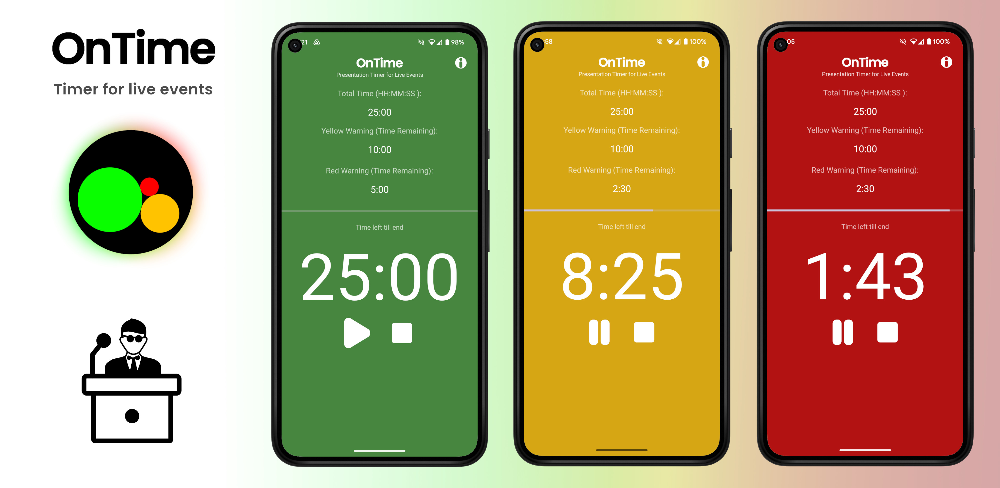

 

<!--   -->

  
  
  

**OnTime** is a simple app for managing time during live events, presentations, and speeches. It provides clear, color-coded alerts to help speakers stay on track.

## Features
- **Timer**: Set total time, yellow warning, and red warning durations.
- **Color alerts like a traffic light:**
  - **Green**: Time remaining.
  - **Yellow**: Warning phase.
  - **Red**: Critical or overtime.
- **Pause and Resume**
- **Overtime Timer**: Shows time over the set amount.
- **Saved Settings**: Retains your preferences between sessions.
- **Multiple Timers**: Swipe left and right between saved timers.
- **Delete Timer**: Swipe up to reveal and delete the current timer.

## Usage
1. Set your desired total, yellow, and red warning times.
2. Start the timer with the play button.
3. During presentation , glance the app for background color to manage your time:
   - Green: On track.
   - Yellow: Time running out.
   - Red: Time running out or over.
4. Pause, resume, or reset as needed.
5. Swipe right to access a new timer, this way you can have multiple saved presets.
6. Swipe up to reveal and delete one of the timers.

## License

This project is licensed under the **GPL-3.0-or-later**. See the [LICENSE](./LICENSE) file for details.

Developed by **Jakob Kreft**.
