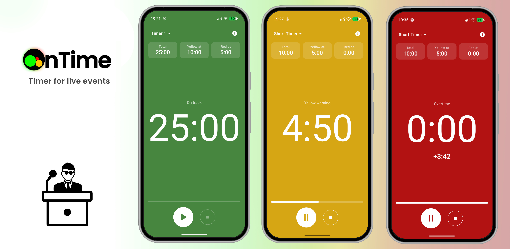
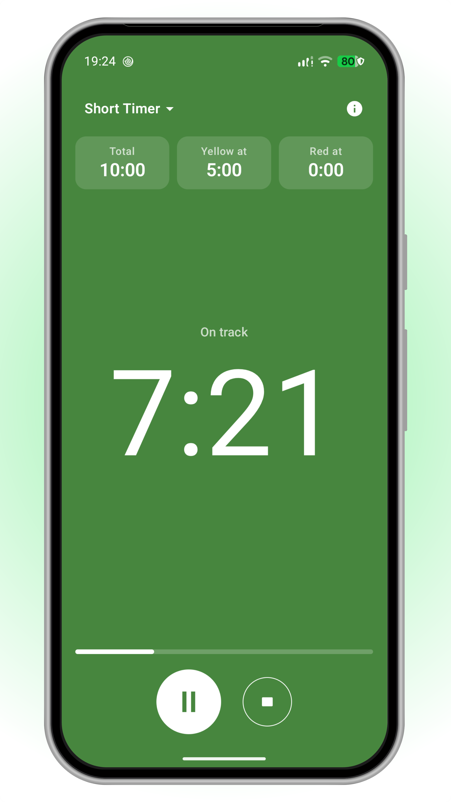
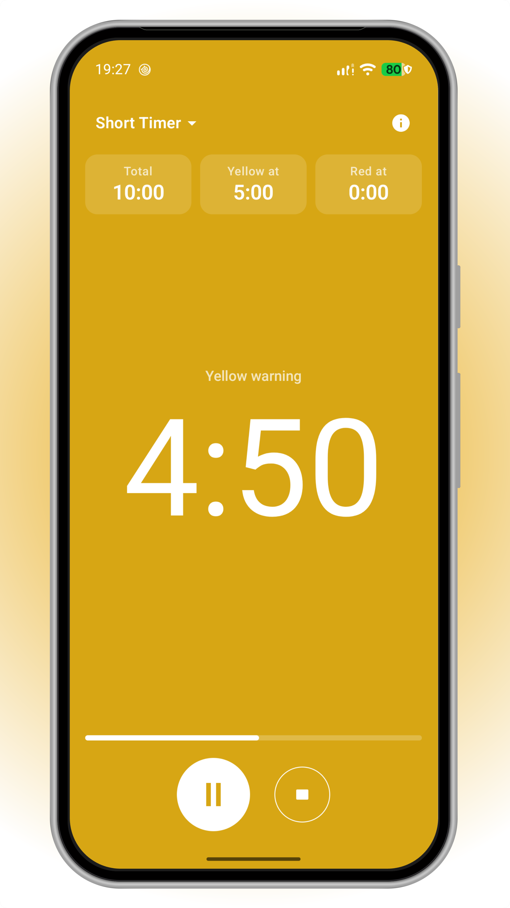
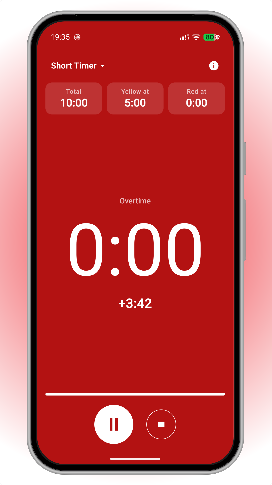
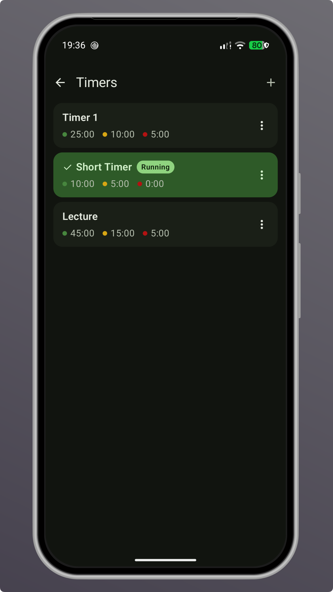

   [](https://github.com/jakobkreft/OnTime/releases)

[](https://f-droid.org/packages/si.jakobkreft.ontime/)

<div style="white-space: nowrap;">
  <a href="https://play.google.com/store/apps/details?id=si.jakobkreft.ontime&pcampaignid=MKT-Other-global-all-co-prtnr-py-PartBadge-Mar2515-1" style="display: inline-block;">
    
  </a>
  <a href="https://f-droid.org/packages/si.jakobkreft.ontime" style="display: inline-block;">
    
  </a>
  <a href="https://github.com/jakobkreft/OnTime/releases/latest" style="display: inline-block;">
    
  </a>
</div>

**OnTime** keeps speakers on schedule at live events, presentations and lectures. The whole screen
is the signal: green while there is room, yellow when it is time to wrap up, red when the time is
nearly gone. Past zero the clock keeps counting upwards, so you always know how far over you ran.

Try it in a browser first: [live demo](https://jakobkreft.github.io/Projects/PresentationTimer/index.html).

## Screenshots

| Running | Wrapping up | Overtime | Saved timers |
|:--:|:--:|:--:|:--:|
|  |  |  |  |
| Green until the yellow warning | Yellow, then red, at the times you set | The clock keeps counting past zero | Named timers, switched from the top bar |

## Features

- **Three durations per timer** — total time, plus yellow and red warnings set as the time remaining.
- **Sharp colour changes**, readable from across a room. No fades, no gradients.
- **Overtime clock** that keeps running past zero.
- **Named timers**, as many as you need, in a list you can duplicate and delete from.
- **Full-screen clock** in landscape — tap the clock, or the expand icon, for the time and nothing else. Tap anywhere to come back.
- **The screen stays on** while a timer is on screen.
- **Rotation never disturbs a running timer** — colour, countdown and overtime all carry through.
- **Everything fits one screen.** Nothing scrolls, in either orientation.
- **No permissions**, no network access, no tracking, no analytics.

## Usage

1. Tap the three times at the top to set the total and the two warning points. Durations can be
   typed as `25:00`, `90`, `25m` or `1h30m`; the editor shows what it understood before you save.
2. Press play. Glance at the background colour to see where you stand.
3. Tap the timer's name in the top bar to switch to another saved timer, or to add one.

Warning times are the time *remaining*, not the time elapsed: a red warning of `5:00` turns the
screen red when five minutes are left. Setting a warning to `0:00` skips that phase.

## Building

Requires a JDK 17 or newer and the Android SDK. Everything else is fetched by the Gradle wrapper,
whose distribution is pinned by checksum.

```sh
./gradlew assembleDebug           # debug APK
./gradlew testDebugUnitTest lint  # unit tests and static analysis
./gradlew assembleRelease         # unsigned, minified release APK
```

The release build is deliberately reproducible: no VCS metadata, no dependency-info block, no
signing configuration in the repository, and every dependency pinned in `gradle/libs.versions.toml`.

`app/src/main/assets/adi-registration.properties` holds the developer-verification snippet that
proves ownership of this package name. It is not a secret — it ships inside every published APK —
and it is committed so that a rebuild from source produces a byte-identical file.

## Architecture

Kotlin and Jetpack Compose. One activity, no fragments, no layout XML.

| Package | Contents |
|---|---|
| `domain/` | `DurationText` parses and formats durations. `TimerSnapshot` turns a preset plus an elapsed time into a phase, a remaining time and an overtime. Both are pure and unit-tested. |
| `data/` | `Preset` and `RunState`, persisted as a single JSON document by `PresetRepository`. |
| `ui/` | `TimerViewModel` holds the state; `RunScreen`, `PresetsScreen` and `AboutScreen` draw it. |

A running timer stores *when it started*, never how far it has got, and every value on screen is
derived from that timestamp and the clock. That is why rotation, backgrounding and process death
cannot disturb a run: there is no elapsed-time state to lose. The timestamp comes from
`SystemClock.elapsedRealtime`, so changing the system clock cannot disturb one either.

## Contributing

Bug reports and feature requests are welcome in
[Issues](https://github.com/jakobkreft/OnTime/issues/new/choose). All user-facing text lives in
`app/src/main/res/values/strings.xml`, so translations are straightforward pull requests.

## License

This project is licensed under the **GPL-3.0-or-later**. See the [LICENSE](./LICENSE) file for details.

Developed by **Jakob Kreft**.

<a href="https://buymeacoffee.com/jaak"></a>
